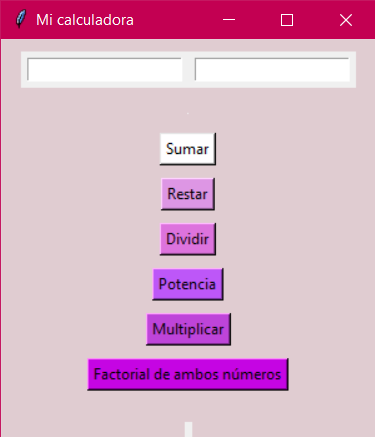

# 🧮 Calculadora en Tkinter

Esta es una calculadora gráfica desarrollada con **Python y Tkinter**, que permite realizar operaciones básicas y funciones adicionales entre dos números.

## ✨ Funcionalidades

- ➕ Suma  
- ➖ Resta  
- ✖️ Multiplicación  
- ➗ División  
- 🧠 Potencia (exponenciación)  
- 🎯 Factorial de ambos números

## 🖼️ Interfaz

La interfaz está construida con `Frames` que combinan `grid()` y `pack()` para lograr una distribución limpia y modular. Se utilizan colores personalizados para mejorar la experiencia visual.

## 📸 Captura de pantalla

```markdown

